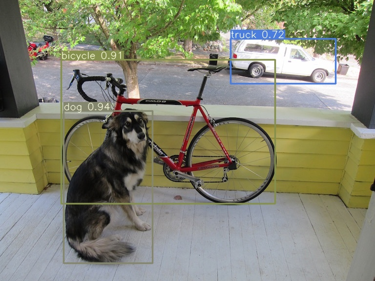
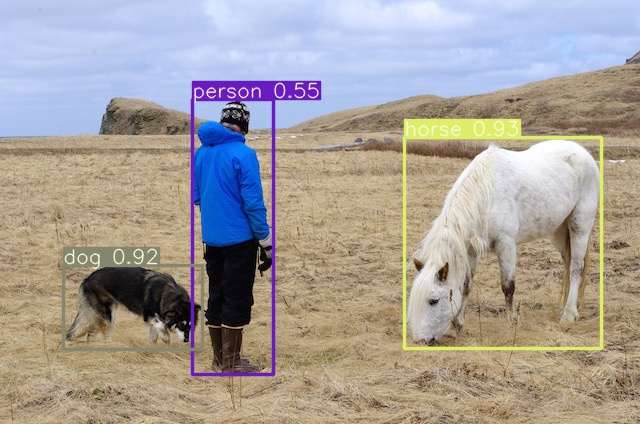

# YOLOv3-PyTorch — Inference Guide

[[Paper]](https://pjreddie.com/media/files/papers/YOLOv3.pdf) [[Project Webpage]](https://pjreddie.com/darknet/yolo/) [[Authors' Implementation]](https://github.com/pjreddie/darknet)

```bibtex
@article{yolov3,
  title={YOLOv3: An Incremental Improvement},
  author={Redmon, Joseph and Farhadi, Ali},
  journal = {arXiv},
  year={2018}
}
```

---

## Prerequisites

We assume you already have the **AIMET CPU/GPU Docker container** pulled and running. If not:

```bash
# CPU example below
docker pull artifacts.codelinaro.org/codelinaro-aimet/aimet-dev:latest.onnx-cpu
docker run -it --shm-size=16g -p 8888:8888 artifacts.codelinaro.org/codelinaro-aimet/aimet-dev:latest.onnx-cpu bash


# Nvidia GPU example below
docker pull artifacts.codelinaro.org/codelinaro-aimet/aimet-dev:latest.onnx-gpu
docker run -it --shm-size=16g -p 8888:8888 artifacts.codelinaro.org/codelinaro-aimet/aimet-dev:latest.onnx-gpu bash
```

Everything below is run **inside the container**.

---

## Step 1 — Clone the Repository

```bash
git clone https://github.com/Hafsa-Iqbal/yolov3-pytorch-inference.git
cd yolov3-pytorch-inference
```

---

## Step 2 — Install Dependencies

```bash
pip install -r requirements.txt
```

---

## Step 3 — Download the Pretrained Weights

Download `best_compat.pth.tar` from the link below:

> **[Download Weights (OneDrive)](https://nuigalwayie-my.sharepoint.com/:f:/g/personal/0135054s_universityofgalway_ie/IgCcpRnA0CfcRKCVpd_SxE4GAbBJEQpP4vv0CEIyZIvlwHI?e=HMLKV5)**

Once downloaded, place the file in the pretrained models folder:

```
yolov3-pytorch-inference/
└── results/
    └── pretrained_models/
        └── best_compat.pth.tar   ← put it here
```

If you downloaded it on your **host machine**, copy it into the running container:

```bash
# Run this on your HOST (not inside the container)
docker cp best_compat.pth.tar <container_id>:/yolov3-pytorch-inference/results/pretrained_models/
```

> **Tip:** Find your container ID with `docker ps`.

---

## Step 4 — Run Inference

The repo provides two sample images in `data/examples/`. Run inference on them:

```bash
PYTHONPATH=. python3 ./tools/inference.py ./data/examples \
  --model-config-path ./model_configs/COCO-Detection/yolov3.cfg \
  --weights ./results/pretrained_models/best_compat.pth.tar \
  --device cpu
```

Output images (with bounding boxes drawn) will be saved to `./results/inference/` by default. To save elsewhere, use `--output`.

### Model inference results

Example outputs from running inference on the sample images in `data/examples/`:

| | |
|:-------------------------:|:-------------------------:|
|  |  |
| *dog.jpg* | *person.jpg* |

To save results to a different folder, use `--output`:

```bash
PYTHONPATH=. python3 ./tools/inference.py ./data/examples \
  --model-config-path ./model_configs/COCO-Detection/yolov3.cfg \
  --weights ./results/pretrained_models/best_compat.pth.tar \
  --device cpu \
  --output ./my_results/
```

---

## Optional Flags

### `--max-images` — Limit the Number of Images

If you're pointing at a folder with thousands of images but only want to process a few:

```bash
PYTHONPATH=. python3 ./tools/inference.py ./data/coco2017/images/valid \
  --model-config-path ./model_configs/COCO-Detection/yolov3.cfg \
  --weights ./results/pretrained_models/best_compat.pth.tar \
  --device cpu \
  --max-images 20
```

Use `-1` (the default) to process all images.

### `--compare-gt` — Side-by-Side Ground Truth Comparison

This saves a combined image with **Ground Truth** boxes (left, green) and **Predicted** boxes (right, red), instead of the normal prediction-only image.

```bash
PYTHONPATH=. python3 ./tools/inference.py ./data/coco2017/images/valid \
  --model-config-path ./model_configs/COCO-Detection/yolov3.cfg \
  --weights ./results/pretrained_models/best_compat.pth.tar \
  --device cpu \
  --compare-gt \
  --max-images 10
```

**Important:** This flag expects YOLO-format ground truth label files alongside the images. The labels folder must mirror the images folder, with `.txt` files instead of `.jpg`:

```
data/coco2017/
├── images/
│   └── valid/
│       ├── 000000000139.jpg
│       ├── 000000098018.jpg
│       └── ...
└── labels/
    └── valid/
        ├── 000000000139.txt
        ├── 000000098018.txt
        └── ...
```

Each `.txt` label file contains one line per object in YOLO format:

```
class_id  center_x  center_y  width  height
```

where all coordinates are **normalized (0–1)** relative to the image dimensions.

Output files will be saved with a `_compare` suffix (e.g., `000000000139_compare.jpg`).

---

## Video inference

To run inference on a video file:

```bash
PYTHONPATH=. python3 ./tools/inference.py ./data/video.mp4 \
  --model-config-path ./model_configs/COCO-Detection/yolov3.cfg \
  --weights ./results/pretrained_models/best_compat.pth.tar \
  --device cpu \
  --output ./results/inference/video
```

Output is saved under `--output` (e.g. `./results/inference/video/video.mp4`). **Docker:** if video won’t open, install OpenCV with FFMPEG — see optional line in `requirements.txt` (`opencv-python-headless`).
